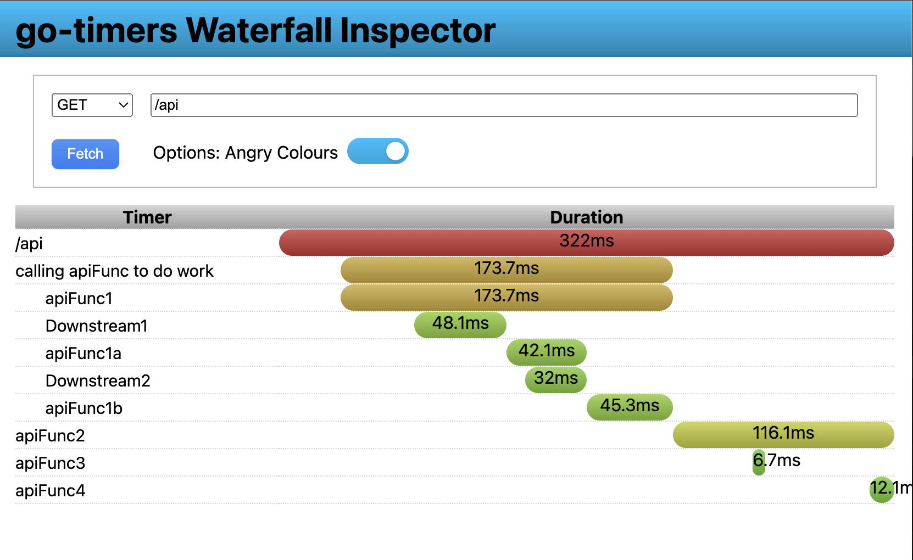

# zafnz/go-timers
[](https://godoc.org/github.com/zafnz/go-timers)
[](https://github.com/zafnz/go-timers/actions/workflows/main.yml)

`go-timers` is a library to assist with timing various code blocks in go in such a way that the values can be 
inspected later, in runtime, without invoking a debugger.

It's original purpose was to track downstream API calls, to measure 
what downstream callers were impacting the handlers the most. 

# Usage

See `examples/main.go` for a full overview, however here are the highlights.

Timers are created and stored in a [context.Context](https://pkg.go.dev/context), this is because the typical
and expect use it they are associated with http transactions. Technically you can get the TimerSet and handle
it yourself, but that's not the idea. 

## Chaining and defer
Timers can be chained, which provides a very nice interaction.
```
t := timers.From(ctx).New("My New Timer").Tag("mine").Start()
```
Due to the chaining they can be used to measure an entire function with just one line:
```
func MyFunction(ctx context.Context, args...) {
    defer timers.From(ctx).New("MyFunction").Start().Stop()
    ...
}
```
This timer will terminate when the function returns. How neat!

You can measure a code segment (such as an API call, etc) with a simple wrapper function that handles the
timer.
```
ctx := timers.NewContext(context.Background())
timers.From(ctx).New("some function").Measure(func() {
    someFunctionThatTakesTime()
})
```

## Output and waterfalls
You can retrieve all timers that have been created using timers.From(ctx).All() and .AllDeep() to get
all the context timers or all the context timers and their children respectively. This can be outputted
as a tree using timers.From(ctx).Tree(callback), or -- if you are writting a web server -- you can use
the Server-Timings header and waterfall display.

Example response! [A very simple fake API with server timings header](https://ovm3l6ntfnnygl2mvv3t5hpq740dnarj.lambda-url.us-west-1.on.aws/f?url=%2Fapi&angry-colors=true)

### http headers

The Middleware function registers a http handler that adds a TimerSet to the request context, and writes
the <a href="https://developer.mozilla.org/en-US/docs/Web/HTTP/Headers/Server-Timing">Server-Timing header</a>. 

Once a Server-Timing header is set, you can view the timings either using the in browser inspector, or you
can use the go-timers built-in waterfall display.

```
mux := http.NewServeMux()
mux.HandleFunc("/api", func(w http.ResponseWriter, r *http.Request) {
    defer timers.From(r.Context()).New("Api Function").Start().Stop()
    // Do stuff.
    fmt.Fprintf(w, "Results of stuff")
})
// Add the waterfall handler too.
// Note the trailing slashes are important!
mux.Handle("/waterfall/", http.StripPrefix("/waterfall/", timers.WaterfallHandler()))
handler := timers.Middleware(mux, timers.MiddlewareOptions{})
http.ListenAndServe("127.0.0.1:3000", handler)
```

### Waterfall
By calling `timers.WaterfallHandler()` you get a http Handler that will render a waterfall of calls to your
web process. See the `examples/waterfall` directory for a very simple example. 

## Grouping/children
Timers can be grouped by deriving a new context.
```
func MyFunc(ctx context.Context) {
    newCtx, _ := timers.NewContextWithTimer(ctx, "A new group of timers that are under the previous ctx")  
    timers.From(newCtx).New("Timer1")
    timers.From(newCtx).New("Timer2")
}
```

A wrap function provides a clean way to do this. 
```
func MyFunc(ctx context.Context) {
    ...
    // You have to provide the ctx to the Wrap function as the TimerSet itself
    // does not hold the context to avoid leaking it. 
    timers.From(ctx).Wrap(ctx, "A library call", func(ctx context.Context) {
        MakeSomeCall(ctx, ...)
    })
    // All timers that MakeSomeCall() created are under "A library call" timer. 
    for _, t := range timers.From(ctx).Find("A library call").Children {
      fmt.Println(t) // Prints all the timers that were created.
    }
}
```
 
## Thread safety

TimerSets are thread (go routine) safe, but Timers are not. Do not pass a Timer to another go routine, instead
pass the ctx and let it create it's own. 

## Global timers and CLI

If you have a desire to have global timers, perhaps you are writing a CLI application or something that isn't
request driven, then the timers package exposes `timers.GlobalTimers` and a convenience function `timers.New`.
The `timers.New(...)` is a wrapper for `timers.GlobalTimers.New(...)`. As is the case with other TimerSets,
GlobalTimers is threadsafe, but the individual timers are not. 

The author cannot fathom what particular use there may be for using timers like this without using a context,
but if you have one, please let me know. 

As for making use of these GlobalTimers, since they are simply a global TimerSet, any of the functions such as
All() and Tree() will work. Perhaps at the end of main() you'd print all the timers for debugging purposes.
In which case calling `timers.GlobalTimers.String()` would probably be useful.
